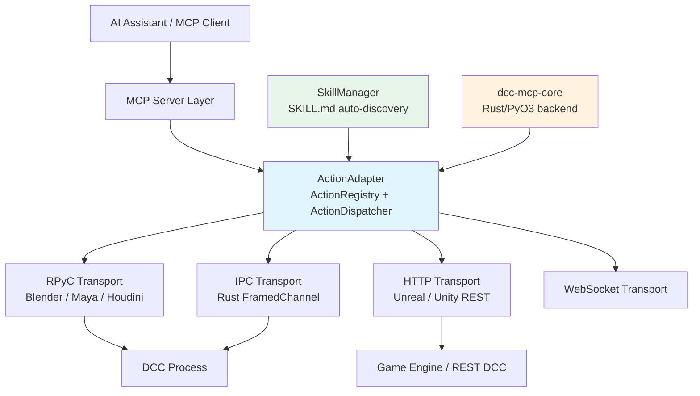

<div align="center">
  
  <h1>DCC-MCP-IPC</h1>
  <p><strong>Multi-protocol IPC adapter layer for DCC software integration with <a href="https://modelcontextprotocol.io/">Model Context Protocol (MCP)</a></strong></p>

  <p>
    <a href="https://badge.fury.io/py/dcc-mcp-ipc"></a>
    <a href="https://github.com/loonghao/dcc-mcp-ipc/actions/workflows/ci.yml"></a>
    <a href="https://pypi.org/project/dcc-mcp-ipc/"></a>
    <a href="https://github.com/loonghao/dcc-mcp-ipc/blob/main/LICENSE"></a>
    <a href="https://github.com/astral-sh/ruff"></a>
    <a href="https://loonghao.github.io/dcc-mcp-ipc/"></a>
  </p>

  <p>
    <a href="https://loonghao.github.io/dcc-mcp-ipc/">Documentation</a> ·
    <a href="./CHANGELOG.md">Changelog</a> ·
    <a href="./CONTRIBUTING.md">Contributing</a>
  </p>
</div>

---

Built on top of **[dcc-mcp-core](https://pypi.org/project/dcc-mcp-core/)** (Rust/PyO3 backend), DCC-MCP-IPC provides a high-performance, type-safe framework for exposing DCC functionality as MCP tools across multiple transport protocols.

> **v2.0.0** (Unreleased) — Breaking changes ahead, see [CHANGELOG.md](./CHANGELOG.md)

## Why DCC-MCP-IPC?

| Feature | Description |
|---------|-------------|
| **Protocol-agnostic** | RPyC for embedded-Python DCCs (Maya/Houdini/Blender), HTTP for Unreal/Unity, WebSocket, and Rust-native IPC for maximum throughput |
| **Zero-code Skills** | Drop a `SKILL.md` file into a directory — `SkillManager` auto-registers it as an MCP tool, no Python boilerplate needed |
| **Rust-powered core** | Action dispatch, validation, and telemetry handled by `dcc-mcp-core` via PyO3; Python layer focuses on DCC-specific glue code |
| **Hot-reload Skills** | `SkillWatcher` monitors skill directories and re-registers tools on file changes without restarting the DCC |
| **Service discovery** | ZeroConf (mDNS) + file-based fallback for automatic DCC server detection |
| **Connection pooling** | `ConnectionPool` with auto-discovery for efficient client-side connection reuse |

## Architecture



### Key Components

| Component | Module | Description |
|-----------|--------|-------------|
| `ActionAdapter` | `action_adapter.py` | Wraps Rust `ActionRegistry` + `ActionDispatcher`; registers handlers and dispatches JSON-parameterised calls |
| `SkillManager` | `skills/scanner.py` | Scans directories for `SKILL.md` skills, registers them as action handlers, supports hot-reload |
| `DCCServer` | `server/dcc.py` | Manages the RPyC/IPC server lifecycle inside a DCC process |
| `BaseDCCClient` | `client/base.py` | Core client connection/call logic with auto-discovery |
| `ConnectionPool` | `client/pool.py` | Connection pooling for efficient resource management |
| `IpcClientTransport` / `IpcServerTransport` | `transport/ipc_transport.py` | Rust-native framed-channel IPC, registered as `"ipc"` protocol |
| `ServiceDiscoveryFactory` | `discovery/factory.py` | Strategy-pattern selector for ZeroConf or file-based discovery |
| `MockDCCService` | `testing/mock_services.py` | Simulates DCC applications for unit and E2E testing |

## Installation

```bash
pip install dcc-mcp-ipc
```

With optional ZeroConf (mDNS) support:

```bash
pip install "dcc-mcp-ipc[zeroconf]"
```

### Requirements

- Python >= 3.8, < 4.0
- [dcc-mcp-core](https://pypi.org/project/dcc-mcp-core/) >= 0.12.0, < 1.0.0
- [rpyc](https://rpyc.readthedocs.io/) >= 6.0.0, < 7.0.0
- Optional: [zeroconf](https://github.com/jstasiak/python-zeroconf) >= 0.38.0 for mDNS discovery

## Quick Start

### Server-side (inside a DCC application)

```python
from dcc_mcp_ipc.server import create_dcc_server, DCCRPyCService


class BlenderService(DCCRPyCService):
    def exposed_get_scene_info(self, conn=None):
        import bpy
        return {
            "file": bpy.data.filepath or "untitled",
            "objects": [obj.name for obj in bpy.data.objects],
            "frame": bpy.context.scene.frame_current,
        }

    def exposed_add_primitive(self, ptype="SPHERE", location=(0, 0, 0), conn=None):
        import bpy
        bpy.ops.mesh.primitive_uv_sphere_add(location=location)
        return {"success": True, "name": bpy.context.object.name}


server = create_dcc_server(dcc_name="blender", service_class=BlenderService, port=18814)
server.start(threaded=True)
```

### Client-side

```python
from dcc_mcp_ipc.client import BaseDCCClient

client = BaseDCCClient("blender", host="localhost", port=18814)
client.connect()

info = client.call("get_scene_info")
print(f"Scene: {info['file']}, Objects: {info['objects']}")

result = client.call("add_primitive", ptype="SPHERE", location=[1, 0, 0])
print(f"Created: {result['name']}")

client.disconnect()
```

## Usage Guide

### Action System (v2.0.0+)

The Action system is built on the Rust-backed `ActionRegistry` + `ActionDispatcher`. All parameters are JSON-serialised:

```python
from dcc_mcp_ipc.action_adapter import get_action_adapter

adapter = get_action_adapter("blender")


def create_sphere(radius: float = 1.0, name: str = "Sphere") -> dict:
    return {"success": True, "message": f"Created {name}", "context": {"name": name}}


adapter.register_action(
    "create_sphere",
    create_sphere,
    description="Create a sphere primitive",
    category="modeling",
    tags=["primitive", "mesh"],
)

result = adapter.call_action("create_sphere", radius=2.0, name="MySphere")
print(result.success)    # True
print(result.to_dict())  # {"success": True, ...}
```

### Zero-code Skills via SkillManager

Drop a `SKILL.md` file into a directory and `SkillManager` auto-registers it as an MCP tool:

```
my_skills/
  create_light/
    SKILL.md    # frontmatter: name, description, tools, scripts
    run.py      # executed when the tool is called
```

```python
from dcc_mcp_ipc.skills import SkillManager
from dcc_mcp_ipc.action_adapter import get_action_adapter

adapter = get_action_adapter("blender")
mgr = SkillManager(adapter=adapter, dcc_name="blender")

mgr.load_paths(["/pipeline/skills"])
mgr.start_watching()  # hot-reload on file changes

result = adapter.call_action("create_light", intensity=100.0)
```

### Connection Pool

```python
from dcc_mcp_ipc.client import ConnectionPool

pool = ConnectionPool()

with pool.get_client("blender", host="localhost") as client:
    result = client.call("get_scene_info")
    print(result)
```

### Async Client

```python
import asyncio
from dcc_mcp_ipc.client.async_dcc import AsyncDCCClient


async def main():
    client = AsyncDCCClient("blender", host="localhost", port=18814)
    await client.connect()
    result = await client.call("get_scene_info")
    await client.disconnect()
    return result


asyncio.run(main())
```

### Service Factories

Three factory patterns for different lifecycle needs:

```python
from dcc_mcp_ipc.server import (
    create_service_factory,
    create_shared_service_instance,
    create_raw_threaded_server,
)

# Per-connection instance
service_factory = create_service_factory(BlenderService, scene_manager)

# Shared singleton across all connections
shared_service = create_shared_service_instance(BlenderService, scene_manager)

# Raw threaded server
server = create_raw_threaded_server(service_factory, port=18814)
server.start()
```

### Rust-native IPC Transport

Zero-copy, low-latency messaging via the Rust core:

```python
import os
from dcc_mcp_core import TransportAddress
from dcc_mcp_ipc.transport.ipc_transport import IpcClientTransport, IpcServerTransport, IpcTransportConfig

# Client side
config = IpcTransportConfig(host="localhost", port=19000)
transport = IpcClientTransport(config)
transport.connect()
result = transport.execute("get_scene_info")
transport.disconnect()

# Server side (inside DCC plugin)
addr = TransportAddress.default_local("blender", os.getpid())
server = IpcServerTransport(addr, handler=lambda ch: ch.recv())
bound_addr = server.start()
```

### Testing with Mock Services

```python
from dcc_mcp_ipc.testing.mock_services import MockDCCService
from dcc_mcp_ipc.client import BaseDCCClient

server = MockDCCService.start(port=18814)

client = BaseDCCClient("mock_dcc", host="localhost", port=18814)
client.connect()
info = client.get_dcc_info()
print(info)  # {"name": "mock_dcc", ...}
client.disconnect()
server.stop()
```

## Development

### Setup

```bash
git clone https://github.com/loonghao/dcc-mcp-ipc.git
cd dcc-mcp-ipc
poetry install
```

### Running Tasks

```bash
nox -s pytest          # Run all tests (unit + E2E)
nox -s lint            # Lint: mypy + ruff + isort
nox -s lint-fix        # Auto-fix lint issues
nox -s build           # Build distribution packages
```

### Project Structure

```
dcc-mcp-ipc/
├── src/dcc_mcp_ipc/
│   ├── __init__.py          # Lazy-import public API
│   ├── action_adapter.py    # Action system (Rust-backed)
│   ├── adapter/             # DCC & application adapters
│   ├── client/              # Sync & async clients + connection pool
│   ├── server/              # RPyC server + factories + lifecycle
│   ├── transport/           # RPyC / HTTP / WebSocket / IPC transports
│   ├── discovery/           # ZeroConf + file-based service discovery
│   ├── skills/              # SkillManager zero-code system
│   ├── scene/               # Scene operations interface
│   ├── snapshot/            # Snapshot interface
│   ├── application/         # Generic application adapter/service/client
│   ├── testing/             # Mock services for testing
│   └── utils/               # Errors, DI, decorators, RPyC helpers
├── tests/
│   ├── e2e/                 # End-to-end tests (Blender, Maya, Houdini)
│   └── ...                  # Unit tests mirroring source layout
├── examples/                # Usage examples
├── docs/                    # VitePress documentation site
└── nox_actions/             # Nox task definitions
```

## License

[MIT](./LICENSE)
