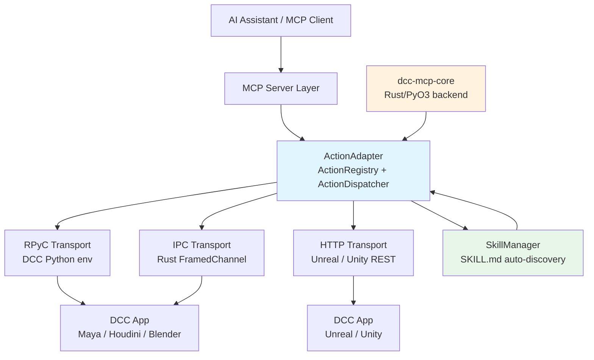

# DCC-MCP-IPC

<div align="center">
    

[](https://badge.fury.io/py/dcc-mcp-ipc)
[](https://github.com/loonghao/dcc-mcp-ipc/actions/workflows/ci.yml)
[](https://pypi.org/project/dcc-mcp-ipc/)
[](https://github.com/loonghao/dcc-mcp-ipc/blob/main/LICENSE)
[](https://github.com/psf/black)
[](https://github.com/astral-sh/ruff)
</div>

**Multi-protocol IPC adapter layer for DCC software integration with [Model Context Protocol (MCP)](https://modelcontextprotocol.io/).**

Built on top of **dcc-mcp-core** (Rust/PyO3 backend), it provides a high-performance, type-safe framework for exposing DCC functionality as MCP tools across multiple transport protocols.

> **Documentation**: [docs site](https://loonghao.github.io/dcc-mcp-ipc/) | **v2.0.0** (Unreleased) — Breaking changes ahead, see [CHANGELOG.md](./CHANGELOG.md)

## Why DCC-MCP-IPC?

| Feature | Description |
|---------|-------------|
| **Protocol-agnostic** | RPyC for embedded-Python DCCs (Maya/Houdini/Blender), HTTP for Unreal/Unity, WebSocket, and Rust-native IPC for maximum throughput. |
| **Zero-code Skills** | Drop a `SKILL.md` file into a directory — `SkillManager` auto-registers it as an MCP tool. No Python boilerplate needed. |
| **Rust-powered core** | Action dispatch, validation, and telemetry handled by dcc-mcp-core via PyO3; Python layer focuses on DCC-specific glue code. |
| **Hot-reload skills** | `SkillWatcher` monitors skill directories and re-registers tools on file changes without restarting the DCC. |
| **Service discovery** | ZeroConf (mDNS) + file-based fallback for automatic DCC server detection. |
| **Connection pooling** | `ConnectionPool` with auto-discovery for efficient client-side connection reuse. |

## Features

- Thread-safe RPyC / HTTP / WebSocket / **Rust-native IPC** server implementations
- **Skills system** — zero-code MCP tool registration from `SKILL.md` frontmatter with hot-reload
- **Action system** backed by `ActionRegistry` + `ActionDispatcher` (Rust) — JSON-serialised parameter dispatch
- **Transport factory** — pluggable transport layer (`rpyc`, `http`, `websocket`, `ipc`)
- Service discovery: ZeroConf (mDNS) + file-based fallback via `ServiceDiscoveryFactory`
- Async client (`asyncio`) for non-blocking operations
- Abstract base classes for creating DCC-specific adapters (`DCCAdapter`) and services
- Application adapter pattern for generic app integration
- Scene & snapshot interfaces over RPyC and HTTP transports
- Mock DCC services for testing without actual DCC applications
- Comprehensive error handling with custom exception hierarchy

## Architecture



### Key Components

| Component | Module | Description |
|-----------|--------|-------------|
| `ActionAdapter` | `action_adapter.py` | Wraps Rust `ActionRegistry` + `ActionDispatcher`; registers handlers and dispatches JSON-parameterised calls |
| `SkillManager` | `skills/scanner.py` | Scans directories for `SKILL.md` skills, registers them as action handlers, supports hot-reload |
| `DCCServer` | `server/dcc.py` | Manages the RPyC/IPC server lifecycle inside a DCC process |
| `BaseDCCClient` | `client/base.py` | Core client connection/call logic with auto-discovery |
| `ConnectionPool` | `client/pool.py` | Connection pooling for efficient resource management |
| `IpcClientTransport` / `IpcServerTransport` | `transport/ipc_transport.py` | Rust-native framed-channel IPC, registered as `"ipc"` protocol |
| `ServiceDiscoveryFactory` | `discovery/factory.py` | Strategy-pattern selector for ZeroConf or file-based discovery |
| `MockDCCService` | `testing/mock_services.py` | Simulates DCC applications for testing |

## Installation

```bash
pip install dcc-mcp-ipc
```

With optional ZeroConf support:

```bash
pip install "dcc-mcp-ipc[zeroconf]"
```

Or with Poetry:

```bash
poetry add dcc-mcp-ipc
```

### Requirements

- Python >= 3.8 (< 4.0)
- [dcc-mcp-core](https://pypi.org/project/dcc-mcp-core/) >= 0.12.0 (< 1.0.0)
- [rpyc](https://rpyc.readthedocs.io/) >= 6.0.0 (< 7.0.0)
- Optional: [zeroconf](https://github.com/jstasiak/python-zeroconf) >= 0.38.0 for mDNS discovery

## Quick Start

### Server-side (within DCC application)

<augment_code_snippet path="README.md" mode="EXCERPT">
````python
from dcc_mcp_ipc.server import create_dcc_server, DCCRPyCService


class MayaService(DCCRPyCService):
    def get_scene_info(self):
        return {"scene": "Maya scene info"}

    def exposed_execute_cmd(self, cmd_name, *args, **kwargs):
        pass


server = create_dcc_server(
    dcc_name="maya",
    service_class=MayaService,
    port=18812,
)
server.start(threaded=True)
````
</augment_code_snippet>

### Client-side

<augment_code_snippet path="README.md" mode="EXCERPT">
````python
from dcc_mcp_ipc.client import BaseDCCClient


client = BaseDCCClient("maya", host="localhost", port=18812)
client.connect()
result = client.call("get_scene_info")
client.disconnect()
````
</augment_code_snippet>

## Usage Guide

### Action System (v2.0.0+)

The Action system is built on the Rust-backed `ActionRegistry` + `ActionDispatcher`. All parameters are JSON-serialised:

<augment_code_snippet path="README.md" mode="EXCERPT">
````python
from dcc_mcp_ipc.action_adapter import ActionAdapter, get_action_adapter


adapter = get_action_adapter("maya")


def create_sphere(radius: float = 1.0, name: str = "sphere1") -> dict:
    return {"success": True, "message": f"Created {name}", "context": {"name": name}}


adapter.register_action(
    "create_sphere",
    create_sphere,
    description="Create a sphere primitive",
    category="modeling",
    tags=["primitive", "mesh"],
)


result = adapter.call_action("create_sphere", radius=2.0, name="mySphere")
print(result.success)   # True
print(result.to_dict()) # {"success": True, ...}
````
</augment_code_snippet>

### Zero-code Skills via SkillManager

Drop a `SKILL.md` file into a directory structure:

```
my_skills/
  create_light/
    SKILL.md      # frontmatter: name, description, tools, scripts
    run.py        # executed when the tool is called
```

<augment_code_snippet path="README.md" mode="EXCERPT">
````python
from dcc_mcp_ipc.skills import SkillManager
from dcc_mcp_ipc.action_adapter import get_action_adapter


adapter = get_action_adapter("maya")
mgr = SkillManager(adapter=adapter, dcc_name="maya")

mgr.load_paths(["/pipeline/skills"])
mgr.start_watching()

# Now "create_light" is callable as an MCP tool
result = adapter.call_action("create_light", intensity=100.0)
````
</augment_code_snippet>

### Connection Pool

<augment_code_snippet path="README.md" mode="EXCERPT">
````python
from dcc_mcp_ipc.client import ConnectionPool


pool = ConnectionPool()

with pool.get_client("maya", host="localhost") as client:
    result = client.call("execute_cmd", "sphere", radius=5)
    print(result)
````
</augment_code_snippet>

### Service Factories

Three factory patterns are available for different lifecycle needs:

<augment_code_snippet path="README.md" mode="EXCERPT">
````python
from dcc_mcp_ipc.server import (
    create_service_factory,
    create_shared_service_instance,
    create_raw_threaded_server,
)


class SceneManager:
    def __init__(self):
        self.scenes = {}

    def add_scene(self, name, data):
        self.scenes[name] = data


scene_manager = SceneManager()

# Per-connection instance
service_factory = create_service_factory(MayaService, scene_manager)

# Shared singleton instance
shared_service = create_shared_service_instance(MayaService, scene_manager)

# Raw threaded server
server = create_raw_threaded_server(service_factory, port=18812)
server.start()
````
</augment_code_snippet>

### Rust-native IPC Transport

Zero-copy low-latency messaging via the Rust core:

<augment_code_snippet path="README.md" mode="EXCERPT">
````python
import os
from dcc_mcp_core import TransportAddress
from dcc_mcp_ipc.transport.ipc_transport import (
    IpcClientTransport,
    IpcServerTransport,
    IpcTransportConfig,
)

# Client side
config = IpcTransportConfig(host="localhost", port=19000)
transport = IpcClientTransport(config)
transport.connect()
result = transport.execute("get_scene_info")
transport.disconnect()

# Server side (inside DCC plugin)
def handle_channel(channel):
    msg = channel.recv()
    # process and respond ...

addr = TransportAddress.default_local("maya", os.getpid())
server = IpcServerTransport(addr, handler=handle_channel)
bound_addr = server.start()
````
</augment_code_snippet>

### Creating a Custom DCC Adapter

<augment_code_snippet path="README.md" mode="EXCERPT">
````python
from dcc_mcp_ipc.adapter import DCCAdapter
from dcc_mcp_ipc.client import BaseDCCClient


class MayaAdapter(DCCAdapter):
    def _initialize_client(self) -> None:
        self.client = BaseDCCClient(
            dcc_name="maya",
            host=self.host,
            port=self.port,
            connection_timeout=self.connection_timeout,
        )

    def create_sphere(self, radius: float = 1.0):
        self.ensure_connected()
        assert self.client is not None
        return self.client.execute_dcc_command(f"sphere -r {radius};")
````
</augment_code_snippet>

### Async Client

<augment_code_snippet path="README.md" mode="EXCERPT">
````python
import asyncio
from dcc_mcp_ipc.client.async_dcc import AsyncDCCClient


async def main():
    client = AsyncDCCClient("maya", host="localhost", port=18812)
    await client.connect()
    result = await client.call("get_scene_info")
    await client.disconnect()


asyncio.run(main())
````
</augment_code_snippet>

### Testing with Mock Services

<augment_code_snippet path="README.md" mode="EXCERPT">
````python
import threading
from dcc_mcp_ipc.testing.mock_services import MockDCCService
from dcc_mcp_ipc.client import BaseDCCClient


server = MockDCCService.start(port=18812)

client = BaseDCCClient("mock_dcc", host="localhost", port=18812)
client.connect()
info = client.get_dcc_info()
print(info)  # {"name": "mock_dcc", ...}
client.disconnect()
server.stop()
````
</augment_code_snippet>

## Development

### Setup

```bash
git clone https://github.com/loonghao/dcc-mcp-ipc.git
cd dcc-mcp-ipc
poetry install
```

### Running Tasks

```bash
nox -s pytest          # Run tests
nox -s lint            # Lint (mypy + ruff + isort)
nox -s lint-fix        # Auto-fix lint issues
nox -s build           # Build distribution packages
```

### Project Structure

```
dcc-mcp-ipc/
├── src/dcc_mcp_ipc/
│   ├── __init__.py              # Lazy-import public API surface
│   ├── action_adapter.py         # Action system (Rust-backed)
│   ├── adapter/                  # DCC & application adapters
│   ├── client/                   # Synchronous & async clients + pool
│   ├── server/                   # RPyC server + factories + lifecycle
│   ├── transport/                # RPyC / HTTP / WS / IPC transports
│   ├── discovery/                # ZeroConf + file-based service discovery
│   ├── skills/                   # SkillManager zero-code system
│   ├── scene/                    # Scene operations interface
│   ├── snapshot/                 # Snapshot interface
│   ├── application/              # Generic application adapter/service/client
│   ├── testing/                  # Mock services for testing
│   └── utils/                    # Errors, DI, decorators, RPyC helpers
├── tests/                        # 68 test files mirroring source layout
├── examples/                     # Usage examples
├── docs/                         # VitePress documentation site
└── nox_actions/                  # Nox task definitions
```

## License

[MIT](./LICENSE)
