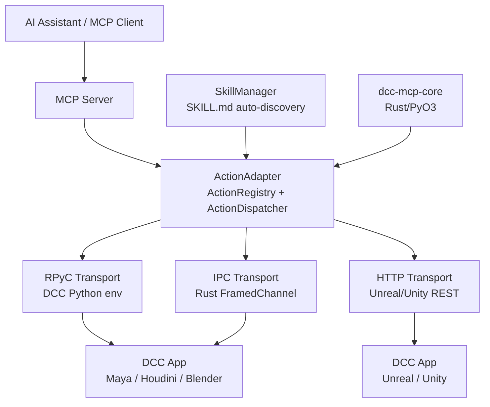

# DCC-MCP-IPC

<div align="center">
    

[](https://badge.fury.io/py/dcc-mcp-ipc)
[](https://github.com/loonghao/dcc-mcp-ipc/actions)
[](https://pypi.org/project/dcc-mcp-ipc/)
[](https://github.com/loonghao/dcc-mcp-ipc/blob/main/LICENSE)
[](https://github.com/psf/black)
[](https://github.com/astral-sh/ruff)
[](https://pepy.tech/project/dcc-mcp-ipc)
</div>

[English](README.md) | [中文](README_zh.md)

Multi-protocol IPC adapter layer for DCC software integration with Model Context Protocol (MCP). Built on top of **dcc-mcp-core** (Rust/PyO3 backend), it provides a high-performance, type-safe framework for exposing DCC functionality as MCP tools.

## Why DCC-MCP-IPC?

- **Protocol-agnostic**: RPyC for embedded-Python DCCs (Maya/Houdini/Blender), HTTP for Unreal/Unity, and the new Rust-native IPC channel for maximum throughput.
- **Zero-code Skills**: Drop a `SKILL.md` file into a directory and the `SkillManager` auto-registers it as an MCP tool — no Python boilerplate required.
- **Rust performance**: Action dispatch, validation, and telemetry are handled by the Rust core via PyO3; Python layer focuses on DCC-specific glue code.
- **Hot-reload**: `SkillWatcher` monitors skill directories and re-registers tools on file changes without restarting the DCC.

## Features

- Thread-safe RPyC server implementation for DCC applications
- **Rust-native IPC transport** (`IpcListener` / `FramedChannel`) for zero-copy low-latency messaging
- **Skills system** — zero-code MCP tool registration from `SKILL.md` frontmatter
- **Hot-reload** of skills via `SkillWatcher` (debounced file watching)
- Service discovery: ZeroConf (mDNS) + file-based fallback
- Abstract base classes for creating DCC-specific adapters and services
- Support for Maya, Houdini, 3ds Max, Nuke, Blender, Unreal Engine, Unity, etc.
- Action system backed by `ActionRegistry` + `ActionDispatcher` (Rust)
- Mock DCC services for testing without actual DCC applications
- Async client (`asyncio`) for non-blocking operations
- Comprehensive error handling and connection management

## Architecture



Key components:

- **`ActionAdapter`**: Wraps `ActionRegistry` + `ActionDispatcher` (Rust) — registers handlers and dispatches JSON-parameterised calls.
- **`SkillManager`**: Scans directories for `SKILL.md` skills, registers them as `ActionAdapter` handlers, supports hot-reload.
- **`IpcClientTransport` / `IpcServerTransport`**: Rust-native framed-channel IPC, registered as `"ipc"` protocol.
- **`DCCServer`**: Manages the RPyC server lifecycle inside a DCC process.
- **`BaseDCCClient` / `ConnectionPool`**: Client-side connection management with auto-discovery and pooling.
- **`MockDCCService`**: Simulates DCC applications for testing and development.

## Installation

```bash
pip install dcc-mcp-ipc
```

Or with Poetry:

```bash
poetry add dcc-mcp-ipc
```

## Usage

### Server-side (within DCC application)

```python
# Create and start a DCC server in Maya
from dcc_mcp_ipc.server import create_dcc_server, DCCRPyCService

# Create a custom service class
class MayaService(DCCRPyCService):
    def get_scene_info(self):
        # Implement Maya-specific scene info retrieval
        return {"scene": "Maya scene info"}

    def exposed_execute_cmd(self, cmd_name, *args, **kwargs):
        # Implement Maya command execution
        pass

# Create and start the server
server = create_dcc_server(
    dcc_name="maya",
    service_class=MayaService,
    port=18812  # Optional, will use random port if not specified
)

# Start the server (threaded=True to avoid blocking Maya's main thread)
server.start(threaded=True)
```

### Using Service Factories

```python
from dcc_mcp_ipc.server import create_service_factory, create_shared_service_instance, create_raw_threaded_server

# Create a shared state manager
class SceneManager:
    def __init__(self):
        self.scenes = {}

    def add_scene(self, name, data):
        self.scenes[name] = data

# Method 1: Create a service factory (new instance per connection)
scene_manager = SceneManager()
service_factory = create_service_factory(MayaService, scene_manager)

# Method 2: Create a shared service instance (single instance for all connections)
shared_service = create_shared_service_instance(MayaService, scene_manager)

# Create a server with the service factory
server = create_raw_threaded_server(service_factory, port=18812)
server.start()
```

### Parameter Handling

```python
from dcc_mcp_ipc.utils.rpyc_utils import deliver_parameters, execute_remote_command

# Process RPyC NetRef parameters
params = {"radius": 5.0, "create": True, "name": "mySphere"}
processed = deliver_parameters(params)
```

### Using the Action System (v2.0.0+)

```python
from dcc_mcp_ipc.action_adapter import ActionAdapter, get_action_adapter

# Get or create an adapter (cached by name)
adapter = get_action_adapter("maya")

# Register a handler function
def create_sphere(radius: float = 1.0, name: str = "sphere1") -> dict:
    # DCC-specific implementation
    return {"success": True, "message": f"Created {name}", "context": {"name": name, "radius": radius}}

adapter.register_action(
    "create_sphere",
    create_sphere,
    description="Create a sphere primitive",
    category="modeling",
    tags=["primitive", "mesh"],
)

# Dispatch the action — params are JSON-serialised automatically
result = adapter.call_action("create_sphere", radius=2.0, name="mySphere")
print(result.success)   # True
print(result.message)   # "Created mySphere"

# Serialise to plain dict
data = result.to_dict()
```

### Zero-code Skills via SkillManager

Drop a `SKILL.md` file anywhere:

```
my_skills/
  create_light/
    SKILL.md      ← frontmatter with name, description, tools, scripts
    run.py        ← executed when the tool is called
```

```python
from dcc_mcp_ipc.skills import SkillManager
from dcc_mcp_ipc.action_adapter import get_action_adapter

adapter = get_action_adapter("maya")
mgr = SkillManager(adapter=adapter, dcc_name="maya")

# Scan and register all skills from a directory
mgr.load_paths(["/pipeline/skills"])

# Enable hot-reload on file changes
mgr.start_watching()

# Now "create_light" is callable as an MCP tool
result = adapter.call_action("create_light", intensity=100.0)
```

### Rust-native IPC Transport

```python
import os
from dcc_mcp_core import TransportAddress
from dcc_mcp_ipc.transport.ipc_transport import IpcClientTransport, IpcTransportConfig

# Client side (MCP server / test)
config = IpcTransportConfig(host="localhost", port=19000)
transport = IpcClientTransport(config)
transport.connect()
result = transport.execute("get_scene_info")
transport.disconnect()

# Server side (inside DCC plugin)
from dcc_mcp_ipc.transport.ipc_transport import IpcServerTransport

def handle_channel(channel):
    msg = channel.recv()
    # ... process and respond ...

addr = TransportAddress.default_local("maya", os.getpid())
server = IpcServerTransport(addr, handler=handle_channel)
bound_addr = server.start()
print(f"IPC server at: {bound_addr}")
```

### Using Mock DCC Services for Testing

```python
import threading
import rpyc
from rpyc.utils.server import ThreadedServer
from dcc_mcp_ipc.client import BaseDCCClient
from dcc_mcp_ipc.utils.discovery import register_service

# Create a mock DCC service
class MockDCCService(rpyc.Service):
    def exposed_get_dcc_info(self, conn=None):
        return {
            "name": "mock_dcc",
            "version": "1.0.0",
            "platform": "windows",
        }
    
    def exposed_execute_python(self, code, conn=None):
        # Safe execution of Python code in a controlled environment
        local_vars = {}
        exec(code, {}, local_vars)
        if "_result" in local_vars:
            return local_vars["_result"]
        return None

# Start the mock service
server = ThreadedServer(
    MockDCCService,
    port=18812,
    protocol_config={"allow_public_attrs": True}
)

# Register the service for discovery
register_service("mock_dcc", "localhost", 18812)

# Start in a separate thread
thread = threading.Thread(target=server.start, daemon=True)
thread.start()

# Connect a client to the mock service
client = BaseDCCClient("mock_dcc", host="localhost", port=18812)
client.connect()

# Use the client as if it were connected to a real DCC
dcc_info = client.get_dcc_info()
print(dcc_info)  # {"name": "mock_dcc", "version": "1.0.0", "platform": "windows"}
```

### Creating a DCC Adapter

```python
from dcc_mcp_ipc.adapter import DCCAdapter
from dcc_mcp_ipc.client import BaseDCCClient

class MayaAdapter(DCCAdapter):
    def _initialize_client(self) -> None:
        self.client = BaseDCCClient(
            dcc_name="maya",
            host=self.host,
            port=self.port,
            connection_timeout=self.connection_timeout,
        )

    def create_sphere(self, radius: float = 1.0):
        self.ensure_connected()
        assert self.client is not None
        return self.client.execute_dcc_command(f"sphere -r {radius};")
```

## Development

### Setup

```bash
# Clone the repository
git clone https://github.com/loonghao/dcc-mcp-ipc.git
cd dcc-mcp-ipc

# Install dependencies with Poetry
poetry install
```

### Testing

```bash
# Run tests with nox
nox -s pytest

# Run linting
nox -s lint

# Fix linting issues
nox -s lint-fix
```

## License

MIT
