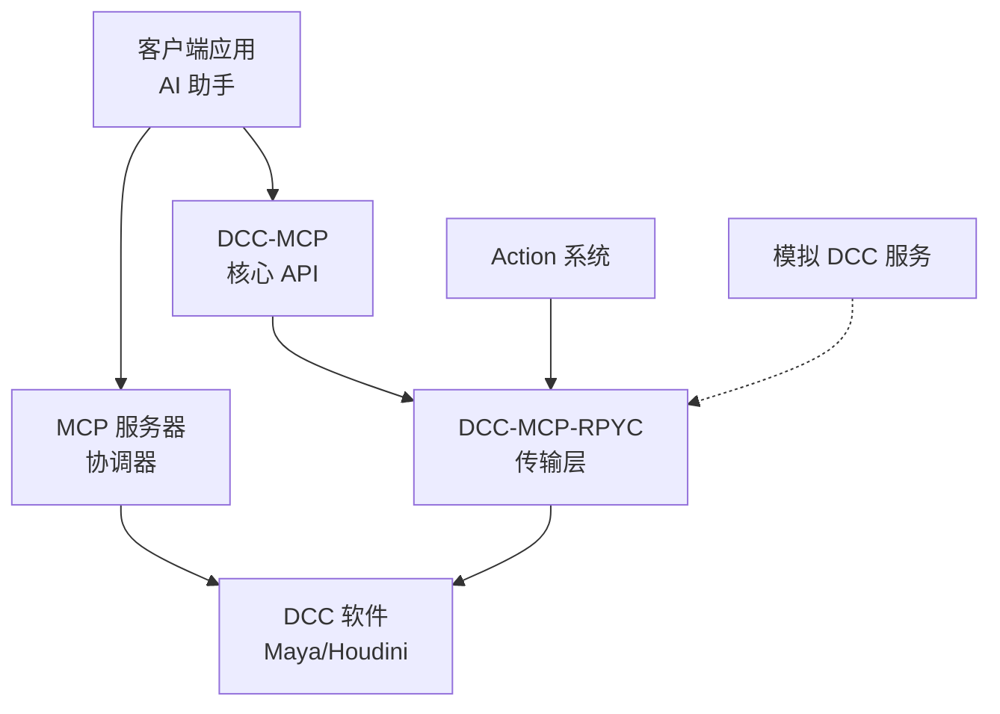

# DCC-MCP-RPYC

<div align="center">
    

[](https://badge.fury.io/py/dcc-mcp-rpyc)
[](https://github.com/loonghao/dcc-mcp-rpyc/actions)
[](https://pypi.org/project/dcc-mcp-rpyc/)
[](https://github.com/loonghao/dcc-mcp-rpyc/blob/main/LICENSE)
[](https://github.com/psf/black)
[](https://github.com/astral-sh/ruff)
[](https://pepy.tech/project/dcc-mcp-rpyc)
</div>

[English](README.md) | [中文](README_zh.md)

基于 RPyC 实现的数字内容创建 (DCC) 软件与模型上下文协议 (MCP) 的集成框架。该包提供了通过 RPYC 暴露 DCC 功能的框架，允许远程控制 DCC 应用程序。

## 为什么选择 RPyC？

RPyC（远程 Python 调用）为 DCC 软件集成提供了显著的优势：

- **动态接口暴露**：RPyC 能够动态地暴露 DCC 应用程序内的接口，通过消除创建静态 API 包装器的需求，减少了开发工作量。
- **原生 API 访问**：能够直接使用原生 DCC API，如 Maya 的 `cmds`/`pymel`、Houdini 的 `hou`、Blender 的 `bpy` 和 Nuke 的 Python API，无需额外的转换层。
- **透明的远程执行**：为本地执行编写的代码可以通过最小的更改远程运行，保留了开发者体验。
- **减少样板代码**：与其他进程间通信方法相比，最小化了进程间通信所需的重复代码。
- **对象引用**：维护对远程对象的实时引用，允许跨进程边界进行自然的面向对象编程。

通过利用 RPyC，DCC-MCP-RPYC 提供了一个统一的框架，在启用远程控制功能的同时保留了每个 DCC 原生 API 的使用体验。

## 特性

- 为 DCC 应用程序提供线程安全的 RPYC 服务器实现
- 提供服务发现机制，用于在网络上查找 DCC 服务
- 提供抽象基类，用于创建特定 DCC 的适配器和服务
- 支持多种 DCC 应用程序（Maya、Houdini、3ds Max、Nuke 等）
- 与模型上下文协议 (MCP) 集成，实现 AI 驱动的 DCC 控制
- 标准化的 Action 系统，可跨不同 DCC 应用程序执行操作
- 模拟 DCC 服务，用于在没有实际 DCC 应用程序的情况下进行测试和开发
- 异步客户端，支持非阻塞操作
- 全面的错误处理和连接管理

## 架构

DCC-MCP-RPYC 的架构设计旨在为控制各种 DCC 应用程序提供统一的接口：



主要组件：

- **DCCServer**：在 DCC 应用程序中管理 RPYC 服务器
- **DCCRPyCService**：通过 RPYC 暴露 DCC 功能的服务基类
- **BaseDCCClient**：用于连接和控制 DCC 应用程序的客户端接口
- **DCCAdapter**：DCC 特定适配器的抽象基类
- **ConnectionPool**：管理和重用与 DCC 服务器的连接
- **ActionAdapter**：连接 Action 系统与 RPYC 服务
- **MockDCCService**：模拟 DCC 应用程序，用于测试和开发

## 安装

```bash
pip install dcc-mcp-rpyc
```

或者使用 Poetry：

```bash
poetry add dcc-mcp-rpyc
```

## 使用方法

### 服务器端（在 DCC 应用程序内）

```python
# 在 Maya 中创建并启动 DCC 服务器
from dcc_mcp_rpyc.server import create_dcc_server, DCCRPyCService

# 创建自定义服务类
class MayaService(DCCRPyCService):
    def get_scene_info(self):
        # 实现 Maya 特定的场景信息获取
        return {"scene": "Maya 场景信息"}

    def exposed_execute_cmd(self, cmd_name, *args, **kwargs):
        # 实现 Maya 命令执行
        pass

# 创建并启动服务器
server = create_dcc_server(
    dcc_name="maya",
    service_class=MayaService,
    port=18812  # 可选，如果不指定将使用随机端口
)

# 启动服务器（threaded=True 避免阻塞 Maya 的主线程）
server.start(threaded=True)
```

### 客户端

```python
from dcc_mcp_rpyc.client import BaseDCCClient

# 连接到 DCC 服务器
client = BaseDCCClient(
    dcc_name="maya",
    host="localhost",
    port=18812  # 可选，如果不指定将自动发现
)

# 连接到服务器
client.connect()

# 调用远程方法
result = client.call("execute_cmd", "sphere", radius=5)
print(result)

# 获取场景信息
scene_info = client.call("get_scene_info")
print(scene_info)

# 完成后断开连接
client.disconnect()
```

### 使用连接池

```python
from dcc_mcp_rpyc.client import ConnectionPool

# 创建连接池
pool = ConnectionPool()

# 从连接池获取客户端（如果需要，会创建新连接）
with pool.get_client("maya", host="localhost") as client:
    # 在客户端上调用方法
    result = client.call("execute_cmd", "sphere", radius=5)
    print(result)

# 连接自动返回到连接池
```

### 创建 DCC 适配器

```python
from dcc_mcp_rpyc.dcc_adapter import DCCAdapter
from dcc_mcp_rpyc.client import BaseDCCClient

class MayaAdapter(DCCAdapter):
    def _create_client(self) -> BaseDCCClient:
        return BaseDCCClient(
            dcc_name="maya",
            host=self.host,
            port=self.port,
            timeout=self.timeout
        )

    def create_sphere(self, radius=1.0):
        self.ensure_connected()
        return self.dcc_client.execute_dcc_command(f"sphere -r {radius};")
```

## 开发

### 环境设置

```bash
# 克隆仓库
git clone https://github.com/loonghao/dcc-mcp-rpyc.git
cd dcc-mcp-rpyc

# 使用 Poetry 安装依赖
poetry install
```

### 测试

```bash
# 使用 nox 运行测试
nox -s pytest

# 运行代码检查
nox -s lint

# 修复代码检查问题
nox -s lint-fix
```

## 许可证

MIT

### 使用服务工厂

```python
from dcc_mcp_rpyc.server import create_service_factory, create_shared_service_instance, create_raw_threaded_server

# 创建共享状态管理器
class SceneManager:
    def __init__(self):
        self.scenes = {}

    def add_scene(self, name, data):
        self.scenes[name] = data

# 方法 1：创建服务工厂（每个连接新实例）
scene_manager = SceneManager()
service_factory = create_service_factory(MayaService, scene_manager)

# 方法 2：创建共享服务实例（所有连接共享一个实例）
shared_service = create_shared_service_instance(MayaService, scene_manager)

# 使用服务工厂创建服务器
server = create_raw_threaded_server(service_factory, port=18812)
server.start()
```

### 参数处理

```python
from dcc_mcp_rpyc.parameters import process_rpyc_parameters, execute_remote_command

# 处理 RPyC 调用的参数
params = {"radius": 5.0, "create": True, "name": "mySphere"}
processed = process_rpyc_parameters(params)

# 使用正确的参数处理在远程连接上执行命令
result = execute_remote_command(connection, "create_sphere", radius=5.0, create=True)
```

### 使用 Action 系统

```python
from dcc_mcp_rpyc.action_adapter import ActionAdapter, get_action_adapter
from dcc_mcp_core.actions.base import Action
from dcc_mcp_core.models import ActionResultModel
from pydantic import BaseModel, Field

# 定义 Action 输入模型
class CreateSphereInput(BaseModel):
    radius: float = Field(default=1.0, description="球体半径")
    name: str = Field(default="sphere1", description="球体名称")

# 定义 Action
class CreateSphereAction(Action):
    name = "create_sphere"
    input_model = CreateSphereInput
    
    def execute(self, input_data: CreateSphereInput) -> ActionResultModel:
        # 实现将使用 DCC 特定的 API
        return ActionResultModel(
            success=True,
            message=f"创建了半径为 {input_data.radius} 的球体 {input_data.name}",
            context={"name": input_data.name, "radius": input_data.radius}
        )

# 获取或创建一个 action adapter
adapter = get_action_adapter("maya")

# 注册 action
adapter.register_action(CreateSphereAction)

# 调用 action
result = adapter.call_action("create_sphere", radius=2.0, name="mySphere")
print(result.message)  # "创建了半径为 2.0 的球体 mySphere"
```

### 使用模拟 DCC 服务进行测试

```python
# 使用新的测试模块中的模拟 DCC 服务
from dcc_mcp_rpyc.testing.mock_services import start_mock_dcc_service, stop_mock_dcc_service
from dcc_mcp_rpyc.client import BaseDCCClient

# 启动模拟 DCC 服务
server, port = start_mock_dcc_service(dcc_name="mock_dcc", host="localhost", port=18812)

# 连接客户端到模拟服务
client = BaseDCCClient("mock_dcc", host="localhost", port=port)
client.connect()

# 将客户端当作连接到真实 DCC 一样使用
dcc_info = client.get_dcc_info()
print(dcc_info)  # {"name": "mock_dcc", "version": "1.0.0", "platform": "windows"}

# 执行 Python 代码
result = client.execute_python("_result = 1 + 1")
print(result)  # 2

# 完成后停止服务
stop_mock_dcc_service(server)
```

## 发布

### 环境设置

```bash
# 克隆仓库
git clone https://github.com/loonghao/dcc-mcp-rpyc.git
cd dcc-mcp-rpyc

# 使用 Poetry 安装依赖
poetry install
```

### 测试

```bash
# 使用 nox 运行测试
nox -s pytest

# 运行代码检查
nox -s lint

# 修复代码检查问题
nox -s lint-fix
```

## 许可证

MIT
