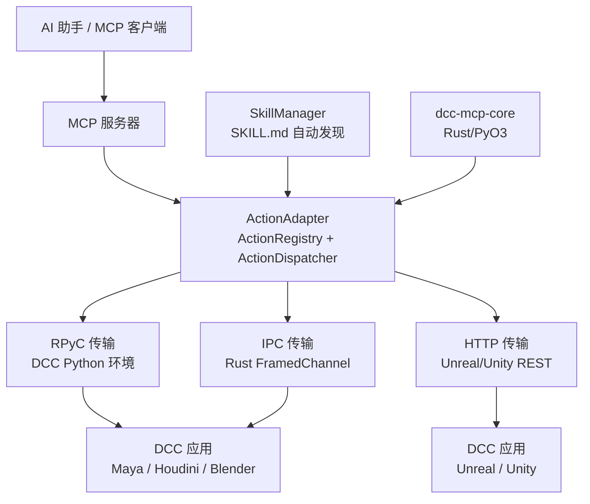

# DCC-MCP-IPC

<div align="center">
    

[](https://badge.fury.io/py/dcc-mcp-ipc)
[](https://github.com/loonghao/dcc-mcp-ipc/actions)
[](https://pypi.org/project/dcc-mcp-ipc/)
[](https://github.com/loonghao/dcc-mcp-ipc/blob/main/LICENSE)
[](https://github.com/psf/black)
[](https://github.com/astral-sh/ruff)
[](https://pepy.tech/project/dcc-mcp-ipc)
</div>

[English](README.md) | [中文](README_zh.md)

DCC 软件与模型上下文协议 (MCP) 集成的多协议 IPC 适配层。基于 **dcc-mcp-core**（Rust/PyO3 后端）构建，为将 DCC 功能作为 MCP 工具暴露提供高性能、类型安全的框架。

## 为什么选择 DCC-MCP-IPC？

- **协议无关**：RPyC 用于内嵌 Python 的 DCC（Maya/Houdini/Blender），HTTP 用于 Unreal/Unity，Rust 原生 IPC 通道提供最高吞吐量。
- **零代码 Skills**：在目录中放置一个 `SKILL.md` 文件，`SkillManager` 就会自动将其注册为 MCP 工具——无需 Python 样板代码。
- **Rust 性能**：Action 派发、验证和遥测由 Rust 核心通过 PyO3 处理；Python 层专注于 DCC 特定的胶水代码。
- **热重载**：`SkillWatcher` 监控 skill 目录，文件变更时无需重启 DCC 即可重新注册工具。

## 特性

- 为 DCC 应用程序提供线程安全的 RPyC 服务器实现
- **Rust 原生 IPC 传输**（`IpcListener` / `FramedChannel`）提供零拷贝低延迟消息传递
- **Skills 系统** — 通过 `SKILL.md` frontmatter 进行零代码 MCP 工具注册
- 通过 `SkillWatcher` 对 skills 进行**热重载**（防抖文件监控）
- 服务发现：ZeroConf（mDNS）+ 文件备份策略
- 提供抽象基类，用于创建特定 DCC 的适配器和服务
- 支持 Maya、Houdini、3ds Max、Nuke、Blender、Unreal Engine、Unity 等
- 由 `ActionRegistry` + `ActionDispatcher`（Rust）支持的 Action 系统
- 模拟 DCC 服务，用于无需实际 DCC 应用程序的测试
- 异步客户端（asyncio）支持非阻塞操作
- 全面的错误处理和连接管理

## 架构


```mermaid
graph TD
    A[AI 助手 / MCP 客户端] --> B[MCP 服务器]
    B --> C[ActionAdapter\nActionRegistry + ActionDispatcher]
    C --> D[RPyC 传输\nDCC Python 环境]
    C --> E[IPC 传输\nRust FramedChannel]
    C --> F[HTTP 传输\nUnreal/Unity REST]
    G[SkillManager\nSKILL.md 自动发现] --> C
    H[dcc-mcp-core\nRust/PyO3] --> C
    D --> I[DCC 应用\nMaya / Houdini / Blender]
    E --> I
    F --> J[DCC 应用\nUnreal / Unity]
```

核心组件：

- **`ActionAdapter`**：包装 `ActionRegistry` + `ActionDispatcher`（Rust）— 注册处理程序并派发 JSON 参数化调用。
- **`SkillManager`**：扫描 `SKILL.md` skills 目录，将其注册为 `ActionAdapter` 处理程序，支持热重载。
- **`IpcClientTransport` / `IpcServerTransport`**：Rust 原生帧通道 IPC，注册为 `"ipc"` 协议。
- **`DCCServer`**：管理 DCC 进程内的 RPyC 服务器生命周期。
- **`BaseDCCClient` / `ConnectionPool`**：客户端连接管理，支持自动发现和连接池。
- **`MockDCCService`**：模拟 DCC 应用程序用于测试和开发。


## 安装

```bash
pip install dcc-mcp-ipc
```

或者使用 Poetry：

```bash
poetry add dcc-mcp-ipc
```

## 使用方法

### 服务器端（在 DCC 应用程序内）

```python
# 在 Maya 中创建并启动 DCC 服务器
from dcc_mcp_ipc.server import create_dcc_server, DCCRPyCService

# 创建自定义服务类
class MayaService(DCCRPyCService):
    def get_scene_info(self):
        # 实现 Maya 特定的场景信息获取
        return {"scene": "Maya 场景信息"}

    def exposed_execute_cmd(self, cmd_name, *args, **kwargs):
        # 实现 Maya 命令执行
        pass

# 创建并启动服务器
server = create_dcc_server(
    dcc_name="maya",
    service_class=MayaService,
    port=18812  # 可选，如果不指定将使用随机端口
)

# 启动服务器（threaded=True 避免阻塞 Maya 的主线程）
server.start(threaded=True)
```

### 客户端

```python
from dcc_mcp_ipc.client import BaseDCCClient

# 连接到 DCC 服务器
client = BaseDCCClient(
    dcc_name="maya",
    host="localhost",
    port=18812  # 可选，如果不指定将自动发现
)

# 连接到服务器
client.connect()

# 调用远程方法
result = client.call("execute_cmd", "sphere", radius=5)
print(result)

# 获取场景信息
scene_info = client.call("get_scene_info")
print(scene_info)

# 完成后断开连接
client.disconnect()
```

### 使用连接池

```python
from dcc_mcp_ipc.client import ConnectionPool

# 创建连接池
pool = ConnectionPool()

# 从连接池获取客户端（如果需要，会创建新连接）
with pool.get_client("maya", host="localhost") as client:
    # 在客户端上调用方法
    result = client.call("execute_cmd", "sphere", radius=5)
    print(result)

# 连接自动返回到连接池
```

### 创建 DCC 适配器

```python
from dcc_mcp_ipc.adapter import DCCAdapter
from dcc_mcp_ipc.client import BaseDCCClient

class MayaAdapter(DCCAdapter):
    def _initialize_client(self) -> None:
        self.client = BaseDCCClient(
            dcc_name="maya",
            host=self.host,
            port=self.port,
            connection_timeout=self.connection_timeout,
        )

    def create_sphere(self, radius: float = 1.0):
        self.ensure_connected()
        assert self.client is not None
        return self.client.execute_dcc_command(f"sphere -r {radius};")
```

## 开发

### 环境设置

```bash
# 克隆仓库
git clone https://github.com/loonghao/dcc-mcp-ipc.git
cd dcc-mcp-ipc

# 使用 Poetry 安装依赖
poetry install
```

### 测试

```bash
# 使用 nox 运行测试
nox -s pytest

# 运行代码检查
nox -s lint

# 修复代码检查问题
nox -s lint-fix
```

## 许可证

MIT

