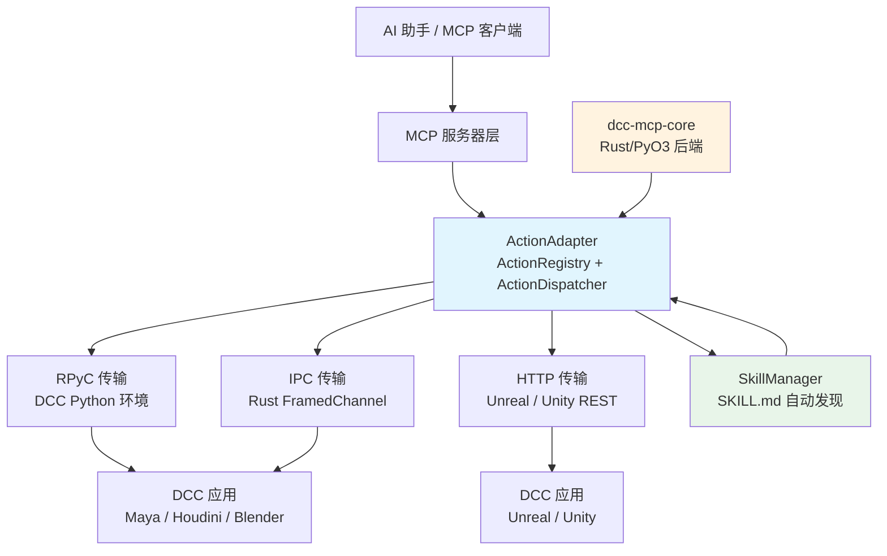

# DCC-MCP-IPC

<div align="center">
    

[](https://badge.fury.io/py/dcc-mcp-ipc)
[](https://github.com/loonghao/dcc-mcp-ipc/actions/workflows/ci.yml)
[](https://pypi.org/project/dcc-mcp-ipc/)
[](https://github.com/loonghao/dcc-mcp-ipc/blob/main/LICENSE)
[](https://github.com/psf/black)
[](https://github.com/astral-sh/ruff)
</div>

**DCC 软件与 [模型上下文协议 (MCP)](https://modelcontextprotocol.io/) 集成的多协议 IPC 适配层。**

基于 **dcc-mcp-core**（Rust/PyO3 后端）构建，为将 DCC 功能作为 MCP 工具暴露提供高性能、类型安全的框架，支持多种传输协议。

> **文档**: [文档站点](https://loonghao.github.io/dcc-mcp-ipc/) | **v2.0.0**（未发布）— 包含破坏性变更，请参阅 [CHANGELOG.md](./CHANGELOG.md)

## 为什么选择 DCC-MCP-IPC？

| 特性 | 说明 |
|------|------|
| **协议无关** | RPyC 用于内嵌 Python 的 DCC（Maya/Houdini/Blender），HTTP 用于 Unreal/Unity，WebSocket，以及 Rust 原生 IPC 通道提供最高吞吐量。 |
| **零代码 Skills** | 在目录中放置一个 `SKILL.md` 文件，`SkillManager` 就会自动将其注册为 MCP 工具，无需 Python 样板代码。 |
| **Rust 性能核心** | Action 派发、验证和遥测由 dcc-mcp-core 通过 PyO3 处理；Python 层专注于 DCC 特定的胶水代码。 |
| **热重载 Skills** | `SkillWatcher` 监控 skill 目录，文件变更时无需重启 DCC 即可重新注册工具。 |
| **服务发现** | ZeroConf（mDNS）+ 文件备份策略，自动检测 DCC 服务器。 |
| **连接池** | `ConnectionPool` 支持自动发现，实现高效的客户端连接复用。 |

## 功能特性

- 线程安全的 RPyC / HTTP / WebSocket / **Rust 原生 IPC** 服务器实现
- **Skills 系统** — 通过 `SKILL.md` frontmatter 进行零代码 MCP 工具注册，支持热重载
- **Action 系统** — 基于 `ActionRegistry` + `ActionDispatcher`（Rust），使用 JSON 序列化参数派发
- **传输工厂** — 可插拔传输层（`rpyc`、`http`、`websocket`、`ipc`）
- 服务发现：ZeroConf（mDNS）+ 文件备份策略，通过 `ServiceDiscoveryFactory` 统一管理
- 异步客户端（asyncio）支持非阻塞操作
- 提供抽象基类，用于创建特定 DCC 的适配器（`DCCAdapter`）和服务
- 应用适配器模式，支持通用应用集成
- 通过 RPyC 和 HTTP 传输的场景与快照接口
- 模拟 DCC 服务，用于无需实际 DCC 应用程序的测试
- 包含自定义异常体系的全面错误处理

## 架构


```mermaid
graph TD
    A[AI 助手 / MCP 客户端] --> B[MCP 服务器层]
    B --> C[ActionAdapter\nActionRegistry + ActionDispatcher]
    C --> D[RPyC 传输\nDCC Python 环境]
    C --> E[IPC 传输\nRust FramedChannel]
    C --> F[HTTP 传输\nUnreal / Unity REST]
    C --> G[WebSocket 传输]
    G[SkillManager\nSKILL.md 自动发现] --> C
    H[dcc-mcp-core\nRust/PyO3 后端] --> C
    D --> I[DCC 应用\nMaya / Houdini / Blender]
    E --> I
    F --> J[DCC 应用\nUnreal / Unity]

    style C fill:#e1f5fe
    style H fill:#fff3e0
    style G fill:#e8f5e9
```

### 核心组件

| 组件 | 模块 | 说明 |
|------|------|------|
| `ActionAdapter` | `action_adapter.py` | 包装 Rust `ActionRegistry` + `ActionDispatcher`；注册处理程序并派发 JSON 参数化调用 |
| `SkillManager` | `skills/scanner.py` | 扫描 `SKILL.md` skills 目录，注册为 action 处理程序，支持热重载 |
| `DCCServer` | `server/dcc.py` | 管理 DCC 进程内的 RPyC/IPC 服务器生命周期 |
| `BaseDCCClient` | `client/base.py` | 核心客户端连接/调用逻辑，支持自动发现 |
| `ConnectionPool` | `client/pool.py` | 连接池，高效管理客户端连接资源 |
| `IpcClientTransport` / `IpcServerTransport` | `transport/ipc_transport.py` | Rust 原生帧通道 IPC，注册为 `"ipc"` 协议 |
| `ServiceDiscoveryFactory` | `discovery/factory.py` | ZeroConf 或文件服务发现的策略模式选择器 |
| `MockDCCService` | `testing/mock_services.py` | 模拟 DCC 应用程序用于测试 |

## 安装

```bash
pip install dcc-mcp-ipc
```

安装可选的 ZeroConf 支持：

```bash
pip install "dcc-mcp-ipc[zeroconf]"
```

或者使用 Poetry：

```bash
poetry add dcc-mcp-ipc
```

### 依赖要求

- Python >= 3.8 (< 4.0)
- [dcc-mcp-core](https://pypi.org/project/dcc-mcp-core/) >= 0.12.0 (< 1.0.0)
- [rpyc](https://rpyc.readthedocs.io/) >= 6.0.0 (< 7.0.0)
- 可选：[zeroconf](https://github.com/jstasiak/python-zeroconf) >= 0.38.0（mDNS 发现）

## 快速上手

### 服务器端（在 DCC 应用程序内）

```python
from dcc_mcp_ipc.server import create_dcc_server, DCCRPyCService


class MayaService(DCCRPyCService):
    def get_scene_info(self):
        return {"scene": "Maya 场景信息"}

    def exposed_execute_cmd(self, cmd_name, *args, **kwargs):
        pass


server = create_dcc_server(
    dcc_name="maya",
    service_class=MayaService,
    port=18812,
)
server.start(threaded=True)
```

### 客户端

```python
from dcc_mcp_ipc.client import BaseDCCClient


client = BaseDCCClient("maya", host="localhost", port=18812)
client.connect()
result = client.call("get_scene_info")
client.disconnect()
```

## 使用指南

### Action 系统（v2.0.0+）

Action 系统基于 Rust 后端的 `ActionRegistry` + `ActionDispatcher` 构建，所有参数均使用 JSON 序列化：

```python
from dcc_mcp_ipc.action_adapter import ActionAdapter, get_action_adapter


adapter = get_action_adapter("maya")


def create_sphere(radius: float = 1.0, name: str = "sphere1") -> dict:
    return {"success": True, "message": f"Created {name}", "context": {"name": name}}


adapter.register_action(
    "create_sphere",
    create_sphere,
    description="创建一个球体基元",
    category="modeling",
    tags=["primitive", "mesh"],
)


result = adapter.call_action("create_sphere", radius=2.0, name="mySphere")
print(result.success)   # True
print(result.to_dict()) # {"success": True, ...}
```

### 通过 SkillManager 实现零代码 Skills

在目录结构中放置 `SKILL.md` 文件：

```
my_skills/
  create_light/
    SKILL.md      # frontmatter: name, description, tools, scripts
    run.py        # 工具被调用时执行此文件
```

```python
from dcc_mcp_ipc.skills import SkillManager
from dcc_mcp_ipc.action_adapter import get_action_adapter


adapter = get_action_adapter("maya")
mgr = SkillManager(adapter=adapter, dcc_name="maya")

mgr.load_paths(["/pipeline/skills"])
mgr.start_watching()

# 现在 "create_light" 可作为 MCP 工具调用
result = adapter.call_action("create_light", intensity=100.0)
```

### 连接池

```python
from dcc_mcp_ipc.client import ConnectionPool


pool = ConnectionPool()

with pool.get_client("maya", host="localhost") as client:
    result = client.call("execute_cmd", "sphere", radius=5)
    print(result)
```

### 服务工厂

三种工厂模式满足不同生命周期需求：

```python
from dcc_mcp_ipc.server import (
    create_service_factory,
    create_shared_service_instance,
    create_raw_threaded_server,
)


class SceneManager:
    def __init__(self):
        self.scenes = {}

    def add_scene(self, name, data):
        self.scenes[name] = data


scene_manager = SceneManager()

# 每连接一个新实例
service_factory = create_service_factory(MayaService, scene_manager)

# 所有连接共享单一实例
shared_service = create_shared_service_instance(MayaService, scene_manager)

# 原始线程服务器
server = create_raw_threaded_server(service_factory, port=18812)
server.start()
```

### Rust 原生 IPC 传输

通过 Rust 核心实现零拷贝低延迟消息传递：

```python
import os
from dcc_mcp_core import TransportAddress
from dcc_mcp_ipc.transport.ipc_transport import (
    IpcClientTransport,
    IpcServerTransport,
    IpcTransportConfig,
)

# 客户端
config = IpcTransportConfig(host="localhost", port=19000)
transport = IpcClientTransport(config)
transport.connect()
result = transport.execute("get_scene_info")
transport.disconnect()

# 服务器端（DCC 插件内）
def handle_channel(channel):
    msg = channel.recv()
    # 处理并响应...

addr = TransportAddress.default_local("maya", os.getpid())
server = IpcServerTransport(addr, handler=handle_channel)
bound_addr = server.start()
```

### 创建自定义 DCC 适配器

```python
from dcc_mcp_ipc.adapter import DCCAdapter
from dcc_mcp_ipc.client import BaseDCCClient


class MayaAdapter(DCCAdapter):
    def _initialize_client(self) -> None:
        self.client = BaseDCCClient(
            dcc_name="maya",
            host=self.host,
            port=self.port,
            connection_timeout=self.connection_timeout,
        )

    def create_sphere(self, radius: float = 1.0):
        self.ensure_connected()
        assert self.client is not None
        return self.client.execute_dcc_command(f"sphere -r {radius};")
```

### 异步客户端

```python
import asyncio
from dcc_mcp_ipc.client.async_dcc import AsyncDCCClient


async def main():
    client = AsyncDCCClient("maya", host="localhost", port=18812)
    await client.connect()
    result = await client.call("get_scene_info")
    await client.disconnect()


asyncio.run(main())
```

### 使用模拟服务进行测试

```python
from dcc_mcp_ipc.testing.mock_services import MockDCCService
from dcc_mcp_ipc.client import BaseDCCClient


server = MockDCCService.start(port=18812)

client = BaseDCCClient("mock_dcc", host="localhost", port=18812)
client.connect()
info = client.get_dcc_info()
print(info)  # {"name": "mock_dcc", ...}
client.disconnect()
server.stop()
```

## 开发

### 环境设置

```bash
git clone https://github.com/loonghao/dcc-mcp-ipc.git
cd dcc-mcp-ipc
poetry install
```

### 常用命令

```bash
nox -s pytest          # 运行测试
nox -s lint            # 代码检查（mypy + ruff + isort）
nox -s lint-fix        # 自动修复代码规范问题
nox -s build           # 构建发布包
```

### 项目结构

```
dcc-mcp-ipc/
├── src/dcc_mcp_ipc/
│   ├── __init__.py              # 懒加载公共 API 入口
│   ├── action_adapter.py         # Action 系统（Rust 后端）
│   ├── adapter/                  # DCC 和应用适配器
│   ├── client/                   # 同步/异步客户端 + 连接池
│   ├── server/                   # RPyC 服务器 + 工厂 + 生命周期
│   ├── transport/                # RPyC / HTTP / WS / IPC 传输层
│   ├── discovery/                # ZeroConf + 文件服务发现
│   ├── skills/                   # SkillManager 零代码系统
│   ├── scene/                    # 场景操作接口
│   ├── snapshot/                 # 快照接口
│   ├── application/              # 通用应用适配器/服务/客户端
│   ├── testing/                  # 测试用模拟服务
│   └── utils/                    # 错误、DI、装饰器、RPyC 工具
├── tests/                        # 68 个测试文件，与源码结构对应
├── examples/                     # 使用示例
├── docs/                         # VitePress 文档站点
└── nox_actions/                  # Nox 任务定义
```

## 许可证

[MIT](./LICENSE)
