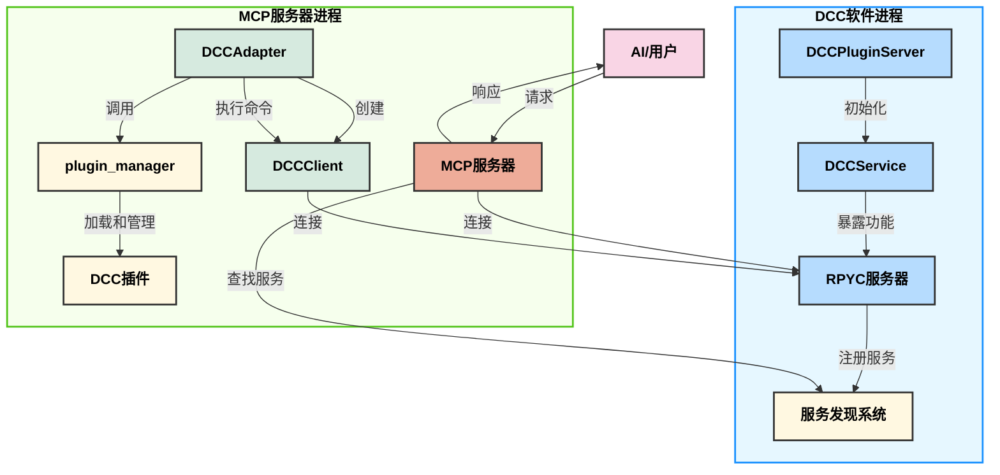
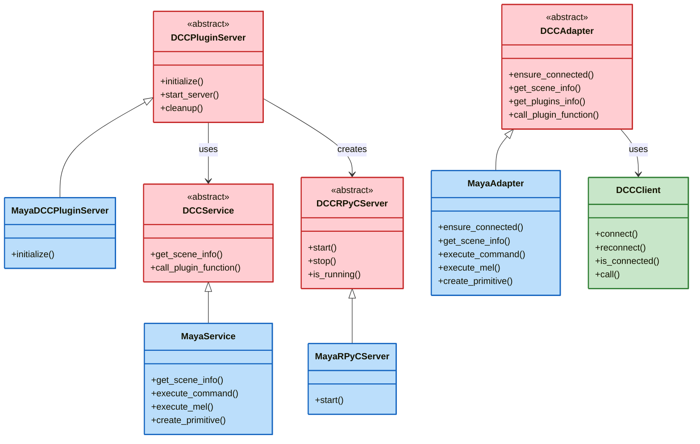
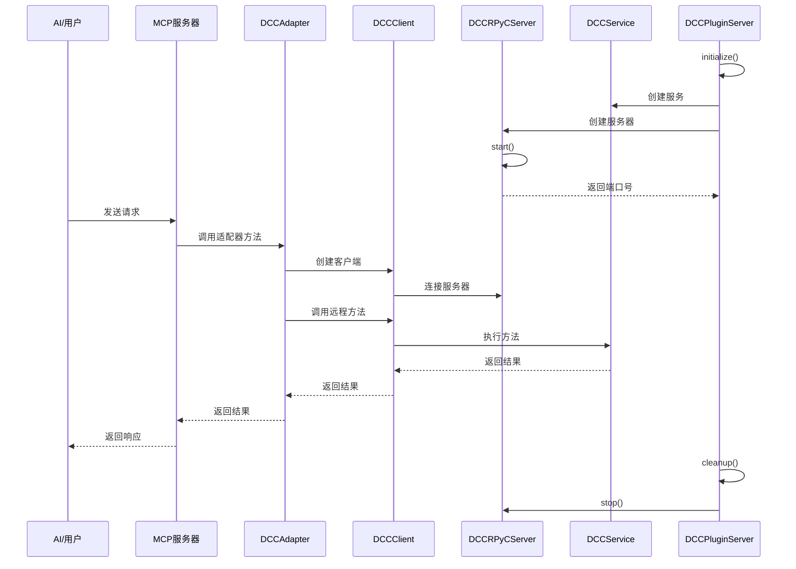

# DCC-MCP-RPYC 架构

## 组件关系图

## 类关系图

## 序列图

## 工作流程说明

1. **初始化阶段**：
   - DCC软件加载插件（`MayaDCCPluginServer`）
   - 插件初始化并创建服务（`MayaService`）
   - 插件启动RPYC服务器（`MayaRPyCServer`）
   - 服务器注册到服务发现系统

2. **连接阶段**：
   - MCP服务器通过服务发现系统查找DCC服务
   - MCP服务器创建适配器（`MayaAdapter`）
   - 适配器创建客户端（`DCCClient`）并连接到RPYC服务器

3. **请求处理阶段**：
   - AI/用户向MCP服务器发送请求
   - MCP服务器调用适配器方法
   - 适配器通过客户端调用远程服务方法
   - 服务执行方法并返回结果
   - 结果通过客户端、适配器返回给MCP服务器
   - MCP服务器将结果返回给AI/用户

4. **清理阶段**：
   - DCC软件卸载插件时调用清理方法
   - 插件停止RPYC服务器
   - 服务器从服务发现系统注销
