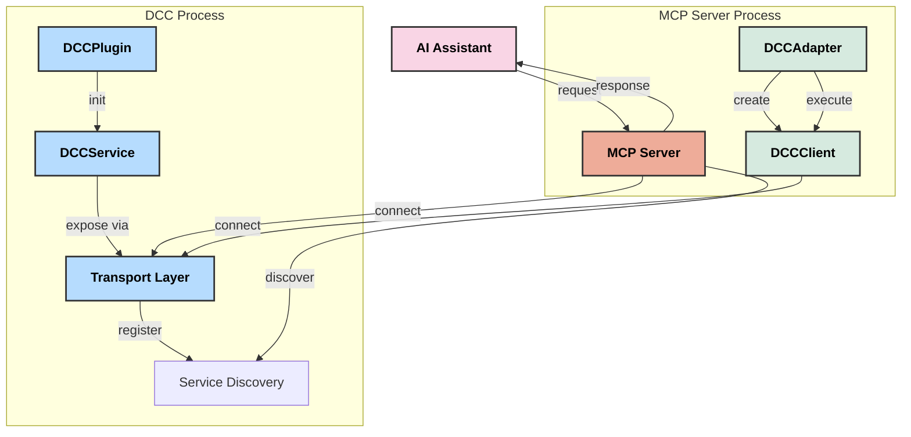
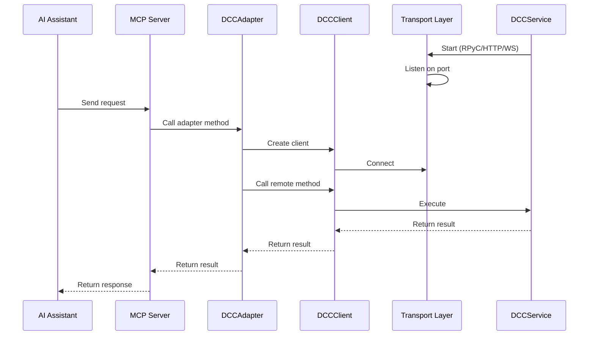

# Architecture

## Component Diagram

```mermaid
graph TD
    classDef aiNode fill:#f9d5e5,stroke:#333,stroke-width:2px,color:#000000,font-weight:bold;
    classDef mcpNode fill:#eeac99,stroke:#333,stroke-width:2px,color:#000000,font-weight:bold;
    classDef dccNode fill:#b6dcfe,stroke:#333,stroke-width:2px,color:#000000,font-weight:bold;
    classDef serviceNode fill:#d6eadf,stroke:#333,stroke-width:2px,color:#000000,font-weight:bold;

    AI[AI Assistant] --> |request| MCP[MCP Server]

    subgraph "DCC Process"
        DCCPlugin --> |init| DCCService
        DCCService --> |expose via| Transport[Transport Layer]
        Transport --> |register| Discovery[Service Discovery]
    end

    subgraph "MCP Server Process"
        MCP --> |discover| Discovery
        MCP --> |connect| Transport
        DCCAdapter --> |create| DCCClient
        DCCClient --> |connect| Transport
        DCCAdapter --> |execute| DCCClient
    end

    MCP --> |response| AI

    class AI aiNode;
    class MCP mcpNode;
    class DCCPlugin,DCCService,Transport dccNode;
    class DCCAdapter,DCCClient serviceNode;
```

## Sequence Diagram

```mermaid
sequenceDiagram
    participant AI as AI Assistant
    participant MCP as MCP Server
    participant Adapter as DCCAdapter
    participant Client as DCCClient
    participant Transport as Transport Layer
    participant Service as DCCService

    Service->>Transport: Start (RPyC/HTTP/WS)
    Transport->>Transport: Listen on port

    AI->>MCP: Send request
    MCP->>Adapter: Call adapter method
    Adapter->>Client: Create client
    Client->>Transport: Connect
    Adapter->>Client: Call remote method
    Client->>Service: Execute
    Service-->>Client: Return result
    Client-->>Adapter: Return result
    Adapter-->>MCP: Return result
    MCP-->>AI: Return response
```

## Workflow

1. **Initialization**: DCC loads plugin → creates service → starts transport server → registers with discovery
2. **Connection**: MCP server discovers DCC → creates adapter → adapter creates client → connects via transport
3. **Execution**: AI sends request → MCP routes to adapter → adapter calls client → client invokes remote service → result flows back
4. **Cleanup**: DCC unloads plugin → stops transport → unregisters from discovery
